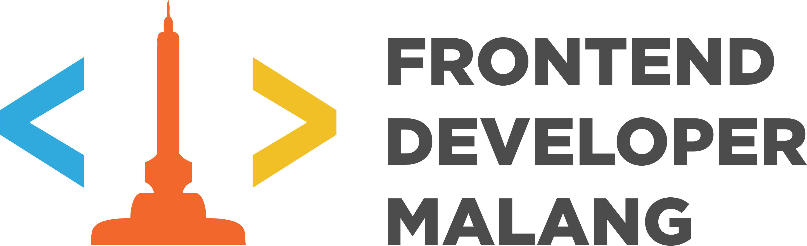
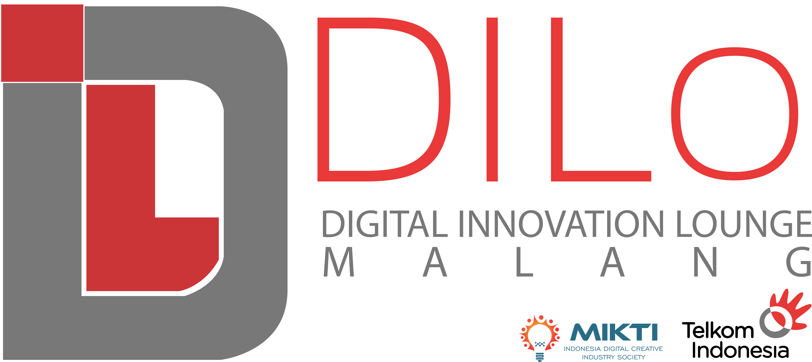

name: page-cover
class: center, middle, cover

.hd[
    
]

.ft[
    
    
]

Ongis School Batch 1 Course 1 (FDMOS0101)

# Introduction to Frontend Development

<!-- by Frontend Developer Malang User Group -->

Malang Digital Lounge, 15 April 2016

---

name: page-template
class: page, as-template

.page-header[
.left[
    Ongis School Batch #1 - Course #01 : Introduction to Frontend Development
]
.right[
    FDM-OS-01-01
].clearfix[]]

.page-footer[
.left[
    ONGIS SCHOOL 2016
]
.right[
    
    
    
].clearfix[]]


---

class: page
template: page-template

# Page Title

--

Lorem ipsum dolor sit amet, consectetur adipisicing elit. Fugiat eaque expedita ut nam, delectus, quaerat id, iste tempore similique assumenda natus dolor. Quod consequuntur nemo hic commodi. Dolorum, eaque, maiores!

--

1. Lorem
--

2. Ipsum
--

3. Dolor

---

class: section-cover, middle, center, bg-blue

# Section Cover

--

## Ops!

---

class: page
template: page-template

# Embedding Source Code

```
.border-radius {
    border-radius: 10px;
    -moz-border-radius: 10px;
    -webkit-border-radius: 10px;
}
```

---

class: page, center
template: page-template

# Embedding Image

.center.middle.default-img[
    
    <!--  -->
]

---

name: page-cover
class: center, middle, cover

.hd[
    
]

.ft[
    
    
]

# Rutam Nuwus
